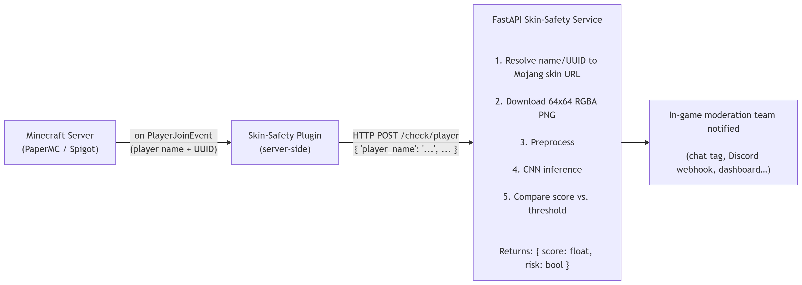

# SkinBouncer

[](LICENSE)

> A binary image classifier that flags Minecraft player skins likely to violate server rules,
> exposed as a REST API a server-side plugin can call on player-join. Built as a CRISP-DM
> end-to-end machine-learning project for the FH ML course.

---

## TL;DR

| | |
|---|---|
| **Problem** | Most large Minecraft servers prohibit certain skin categories (NSFW, hate, harassment, copyrighted characters) but rely on slow, manual after-the-fact moderation. |
| **Goal** | Give moderators an automated, real-time risk score for every incoming player skin — *a warning system, not an auto-banner*. |
| **Data** | ~9,000 "normal" skins from a public Kaggle dataset (Mojang-API sourced) + ~1,000 "Spider-Man" skins scraped from `minecraftskins.com` as a proxy for the real prohibited classes. |
| **Models** | Baselines: majority-class and **PCA + Logistic Regression**. Main: a small **CNN** (Keras) with custom alpha-preserving color augmentation. |
| **Result** | CNN reaches **AUC 0.983 / PR-AUC 0.915** on a test set. At a recall target of 0.95, precision is **57.5 %** (vs. 24 % for the LogReg baseline at the same recall). |
| **Deployment** | **FastAPI** microservice that resolves a player name/UUID, downloads the current skin from Mojang, runs inference and returns a risk score. Designed to be called from a Spigot/PaperMC plugin. |

---

## Why Spider-Man?

The real prohibited categories on Minecraft servers (NSFW, hate symbols, political extremism)
are out of scope for an academic project — both ethically and legally. We chose **copyrighted
character skins, exemplified by Spider-Man**, as a proxy class that:

1. Is itself prohibited on many large servers.
2. Has a visually coherent target (red+blue suit, spider icon, eye pattern, webbing).
3. Is cleanly scrapable from `minecraftskins.com` by keyword.
4. **Exercises the exact same pipeline** (scraper → cleaning → CNN → threshold tuning → API)
   that a production deployment would use for the real classes.

---

## Repository layout

The repository follows the six CRISP-DM phases, one directory per phase:

| Folder | Phase | Contents |
|---|---|---|
| `01_BusinessUnderstanding/` | 1. Business Understanding | Project motivation, scope, success criteria. |
| `02_DataUnderstanding/` | 2. Data Understanding | Data sources, scrapers (UUID-based + keyword-based), EDA. |
| `03_DataPreparation/` | 3. Data Preparation | Loading, normalization, stratified split, augmentation. |
| `04_Modeling/` | 4. Modeling | CNN architecture, baseline, training, hyperparameter discussion. |
| `05_Evaluation/` | 5. Evaluation | Metrics, threshold tuning, baseline vs. CNN comparison. |
| `06_Deployment/` | 6. Deployment | FastAPI service, Mojang skin lookup, deployment scenario. |
| `data/skins/` | — | Skins, split into `good_cleaned/` (class 0) and `bad/spiderman_cleaned/` (class 1). |
| `models/` | — | Trained Keras checkpoints. |

---
## Pipeline

---

## Key results

Reported on a test set of 1,500 stratified samples (class-1 ratio ~10 %).

| Model | AUC | PR-AUC | Threshold | Recall | Precision | FPR |
|---|---|---|---|---|---|---|
| Majority-class baseline | — | — | — | 0.000 | — | 0.000 |
| PCA(50) + Logistic Regression | 0.942 | 0.767 | 0.104 (recall ≥ 0.95) | 0.95 | 0.24 | 31.8 % |
| **CNN** | **0.983** | **0.915** | **0.652 (recall ≥ 0.95)** | **0.95** | **0.58** | **7.5 %** |

The CNN reduces false-positive moderation work by ~76 % vs. the LogReg baseline at the same
recall target, and more than doubles precision.

Full metrics, ROC and PR curves, and the deployment recommendation are in
[`05_Evaluation/Evaluation.ipynb`](05_Evaluation/Evaluation.ipynb).

---

## How to run (not verified)

### Requirements

Python 3.10+ (we developed on 3.11), with the packages listed in `requirements.txt`, plus
the shared `skinbouncer_core` package (installed in editable mode so notebooks, the API,
and the labeling tool all import the same code):

```powershell
pip install -r requirements.txt
pip install -e .
```

### Sample data (optional, for a quick trial run)

The scraper that built the original training set isn't part of this repo (see below). If
you just want to see the pipeline run without supplying your own skins, generate a small
local sample dataset (real skins fetched live from the public Mojang API, plus a
synthetic demo "flagged" category — not committed to the repo, regenerate anytime):

```powershell
python scripts/generate_sample_data.py
```

This creates `sample_data/good/` and `sample_data/bad_demo/` (150 images each - confirmed
by experiment to be enough for the CNN to actually generalize, not just run). See the
script's docstring for provenance details.

### Reproduce the experiments

1. Make sure the dataset is present under `data/skins/good_cleaned/` and
   `data/skins/bad/spiderman_cleaned/`. The notebooks load from these paths directly.
2. Run the notebooks in CRISP order:
   - `01_BusinessUnderstanding/BusinessUnderstanding.ipynb` — project framing.
   - `02_DataUnderstanding/DataUnderstanding.ipynb` — data sources + short EDA.
   - `03_DataPreparation/DataPreparation.ipynb` — loading, splits, augmentation.
   - `04_Modeling/Modeling.ipynb` — train the CNN and threshold tuning.
   - `05_Evaluation/Evaluation.ipynb` — baseline vs. CNN.
   - `06_Deployment/Deployment.ipynb` — wire up the API.

All randomness is seeded (`SEED = 67`).

### Run the deployment API

```powershell
cd 06_Deployment\api
uvicorn main:app --reload --host 0.0.0.0 --port 8000
```

Then `POST http://localhost:8000/check/player/` with a JSON body of the form:

```json
{ "player_name": "Notch" }
```

The service downloads the current skin for the player from the Mojang API, runs inference,
and returns a risk score and a boolean flag.

---

## Fetching skins yourself (optional)

### Skins by UUID (Mojang API, rate-limited)

See `02_DataUnderstanding/Mining/SkinsFromUuid/minecraft_skin_downloader.py`. Builds a
resumable CSV manifest with `(uuid, skin_url, image_path, label)` and idempotently downloads
images by file existence. Useful for fetching a single player's skin at deployment time;
**not** practical for bulk collection due to Mojang rate limits.

---

## Learnings

Things this project taught us, in roughly the order they hurt:

- **Class imbalance + a recall target make threshold tuning the dominant lever.**
  We spent more energy on choosing the operating point on the precision-recall curve than on
  picking the model architecture. Once we adopted a recall-targeted threshold-search on the
  validation set, the gap between baseline and CNN became enormous — *at the same recall*,
  CNN precision is more than double the LogReg baseline's. The model is only half of the
  product; the operating point is the other half.

- **The threshold is the business knob.** It is the single parameter that translates a raw
  model output into a moderation policy. We see this as a deployment-time configuration so
  that individual server admins can dial the system between "aggressive flagging, lots of
  moderator review" and "conservative flagging, only obvious cases".

- **First-time CNN intuition.** Coming from the MNIST CNN example, we found the architectural
  template transferred surprisingly well to 64×64 RGBA skins, *provided* we resisted the
  temptation to apply geometric augmentation. The UV-unwrapped texture layout means rotation /
  flipping / cropping would destroy signal — color-space augmentation is the only safe family.

- **Alpha-as-mask matters.** The alpha channel of a Minecraft skin is structural, not
  cosmetic. We kept all four RGBA channels and wrote a custom `RandomColorShift` layer that
  perturbs only RGB while preserving alpha. This was non-obvious early on and would have
  silently hurt the model if we'd dropped the channel or shifted it uniformly with the others.

- **Manual cleaning false-positives are a self-validation signal.** When the CNN's strongest
  false positives on the "normal" class turned out to be *real* Spider-Man skins that had
  slipped into the Kaggle sample, that was a vote of confidence in the model — it was learning
  the right concept, not noise. Those cases were moved across folders before retraining,
  closing the active-learning loop by hand.

- **Mojang rate-limiting drove a real engineering decision.** The original plan to harvest
  skins from a 51-million-UUID list collapsed under the API rate limit; we pivoted to a Kaggle
  dataset that someone else had paid the rate-limit cost for. The UUID-based downloader still
  earns its keep at *deployment* time, where the per-request rate is negligible.

---

## Future work

- **Train on actual prohibited classes** (NSFW, hate symbols, political extremism). The
  pipeline is unchanged; only the keyword list and the cleaning pass need adapting. This is
  the productization step the project was designed to enable.
- **Multi-class / multi-label classification** with a classifier per prohibited concept type,
  or a single shared multiclass model with multiple output heads.
- **Online / continual learning from moderator feedback.** Every time a moderator overturns or
  confirms a flag in production, that becomes a labeled example. Feed it back, retrain
  incrementally, watch the threshold drift.
- **Open-source release** as a moderator dev-kit: a scraper + training notebook + API
  template that any server operator can run on their own banned-player data to fine-tune the
  model for their own server's policy.
- **Adversarial robustness.** Once the system is known to exist, players will try to evade it
  by changing skins slighty.
- **Region-based CNN** that exploits the fixed UV layout by classifying head / torso / arms /
  legs separately and combining the outputs. An obvious experiment we did not run.

---

## Credits

- **Skin dataset:** [Sha2048's Minecraft Skin Dataset](https://www.kaggle.com/datasets/sha2048/minecraft-skin-dataset) on Kaggle.
- **UUID list (initial attempt):** [matdoes.dev / minecraft-uuids](https://matdoes.dev/minecraft-uuids).
- **Keyword-scraped Spider-Man / military / bikini / WW2 skins:** [`minecraftskins.com`](https://www.minecraftskins.com).
- **Mojang APIs** for runtime skin lookup at deployment time. [Docs](https://minecraft.wiki/w/Mojang_API#Query_player's_UUID)
- **Minecraft Skin Wiki** for the UV-mapping reference: https://minecraft.wiki/w/Skin
- CNN architecture adapted from the an MNIST CNN example notebook. 

This project was developed for the FH machine-learning course; per the course rules, any
code originating from LLMs or other sources is the responsibility of the authors. The
notebooks have been read, understood, and edited by us.
