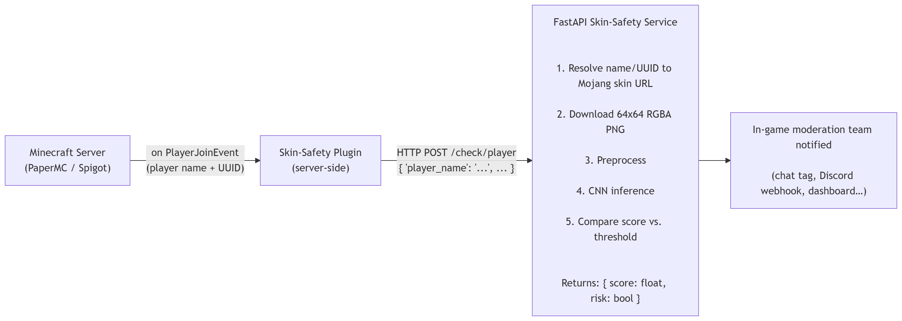

# SkinBouncer

[](LICENSE)
[](https://github.com/tobneu/SkinBouncer/actions/workflows/test.yml)

> Train your own Minecraft skin detectors, then serve them to your server.
> A labeling tool, an active-learning loop, a small CNN, and a REST API a Paper plugin
> calls on player-join — for whatever categories *your* rules actually prohibit.

Most large Minecraft servers prohibit certain skin categories but moderate them by hand,
after the fact. SkinBouncer is the toolkit for building an automated **warning** system:
you label a few hundred skins, train a detector, and the API gives your moderators a risk
score the moment a player joins.

Three things it tries to be:

- **Reusable** — nothing here is specific to one category. A detector is a folder of
  images you labeled; the pipeline is the same whichever concept you point it at.
- **Horizontally scalable** — detectors are independent. Drop a second one next to the
  first and the API scores every joining player against both, under separate keys.
- **Simple** — a desktop labeling tool with a 3D skin preview, and a thin wrapper over
  Keras that hides the parts of a training loop you shouldn't have to rewrite.

It is a warning system, not an auto-banner. Please read [ETHICS.md](ETHICS.md) before
pointing it at a real server — the boundaries there are the point, not boilerplate.



---

## Quickstart

From a fresh clone to a trained detector answering HTTP requests. Roughly 10 minutes,
most of it waiting on downloads.

**Requirements:** Python 3.11+ (developed on 3.13). Installs TensorFlow, so budget ~1 GB.
CPU-only — no GPU needed anywhere in this project.

```bash
pip install -e ".[dev,labeling-tool]"      # or: uv sync --all-extras
```

<details>
<summary>What the extras are for</summary>

`labeling-tool` pulls in pywebview and Qt for the desktop GUI. It's deliberately optional
so the deployment Docker image stays headless. `dev` adds pytest.
</details>

### 1. Get some skins

No dataset ships with this repo. To try the pipeline without supplying your own images,
generate a small one — real skins fetched live from the public Mojang API, plus a
synthetic demo "flagged" category with a self-drawn marker stamped on:

```bash
python scripts/generate_sample_data.py                      # 150 per class
python scripts/generate_sample_data.py --images-per-class 60  # faster, less accurate
```

This writes `sample_data/good/` and `sample_data/bad_demo/` (gitignored — regenerate
anytime). Guessing usernames against Mojang is hit-or-miss, so re-running is safe and
resumes: images already fetched are kept and counted.

> **This is a pipeline demo, not an accuracy demo.** At 150 images per class the CNN
> reaches a validation AUC of about 0.6 — above chance, nowhere near the 0.983 the same
> architecture reaches on the real ~10,000-image dataset it was tuned for, and unstable
> enough that two runs can differ by 0.15. The synthetic marker is small and the dataset
> is tiny; both matter. Everything downstream is real and the metrics are real — the model
> is mediocre because the data is toy data. Point it at your own images for a detector
> that works.

### 2. Set up a detector project

Given a `good/` folder and a `bad/<category>/` folder, this writes a stratified 70/15/15
train/val/test split into a manifest that everything downstream reads:

```bash
python scripts/setup_detector_project.py --good sample_data/good \
    --bad sample_data/bad_demo --project-dir detector_projects/bad_demo
```

The folder name of `--bad` becomes the detector's **category** — the key the API reports
its score under. Re-running is safe: existing assignments are left alone, and images added
since the last run go to train/val only, so the test split never grows or changes. See
[`skinbouncer_core/detector_project.py`](skinbouncer_core/detector_project.py) for the
manifest schema.

### 3. Train

```bash
python scripts/train_detector.py --project-dir detector_projects/bad_demo
```

Writes `model.keras`, `threshold.json` and `metrics.json` into the project. The threshold
is searched on the validation split for a recall target (default 0.95) — it is the knob
that turns a model score into a moderation policy, so it is tuned and stored, not
hardcoded. See [`skinbouncer_core/train.py`](skinbouncer_core/train.py).

### 4. Export and serve

```bash
python scripts/export_detector.py --project-dir detector_projects/bad_demo
api/build.sh
docker run --rm -p 8000:8000 skinbouncer-api:latest
```

Export prints the test-split confusion matrix, then copies the checkpoint and threshold
into `api/models/detectors/<category>/`, which is what the image bakes in.

```bash
curl localhost:8000/
# {"message": "...", "detectors": ["bad_demo"]}

curl -X POST localhost:8000/check/player/ \
     -H 'Content-Type: application/json' -d '{"player_name":"Notch"}'
# {"player_name": "Notch", "categories": {"bad_demo": {"score": 0.02, "risk": false}}}
```

If `detectors` comes back empty, nothing was exported yet — the API says so on stderr at
startup rather than silently scoring nothing.

### 5. Connect a Minecraft server

```bash
./minecraft_plugin/build.sh                     # containerized, no local JDK needed
EULA=TRUE MC_OPS=<your-minecraft-name> \
    docker compose -f api/docker-compose.demo.yml up --build
```

Starts the API and a Paper server together. On join, the plugin scores the player off the
main thread and warns holders of `skinbouncer.notify`. The player is never told and never
kicked. The server must run in **online mode** — the API identifies players through
Mojang. See [`minecraft_plugin/`](minecraft_plugin/).

---

## Running more than one detector

Detectors are independent folders, and the API loads every one it finds:

```
api/models/detectors/
├── bad_demo/       model.keras + threshold.json
└── hate_symbols/   model.keras + threshold.json
```

Every `/check/player/` response carries one entry per detector, each with its own score
and its own threshold:

```json
{"categories": {"bad_demo":     {"score": 0.02, "risk": false},
                "hate_symbols": {"score": 0.88, "risk": true}}}
```

Adding a category means running the same four steps against a different `bad/` folder.
Nothing is registered anywhere; a detector is enabled by being present. Remove the folder
and restart to disable it.

---

## The labeling tool

A desktop app (pywebview) for the part that actually costs time: deciding what each image
is. It shows the flat texture next to a **rotatable 3D model**, because a lot of skins are
unreadable as a UV layout and obvious as a character.

It runs in three modes, sharing one shell.

### Triage a folder

Walks a flat folder one image at a time and moves each file into `good/`, `bad/` or
`skip/` — so its output is directly usable as `--good`/`--bad` input above.

```bash
python scripts/run_labeling_tool.py --folder sample_data/bad_demo
```

Keys: `G`/`→` good, `B`/`←` bad, `Space`/`S` skip. Quitting and re-running resumes with
what's left.

### Active-learning review queue

Instead of a folder walk, ranks a trained project's train+val images by how much the
current checkpoint disagrees with each image's recorded label, and walks them worst-first,
so review effort goes where it changes the model.

```bash
python scripts/run_active_learning_queue.py --project-dir detector_projects/bad_demo
```

Good/Bad here mean *confirm or correct*: pressing the highlighted button is a no-op,
pressing the other one relabels and moves the file immediately. The frozen test split is
never shown.

**Retrain** fine-tunes without leaving the app — warm-starting from the current checkpoint
against the manifest as it now stands, with a live epoch counter and a train/val AUC curve.
When a round finishes it shows the new val AUC against the last up to 5 rounds, so you can
see whether the labeling you just did actually helped. Label a batch, hit Retrain, repeat.

### Blind test-set review

For curating the frozen test split. No prediction, confidence or ranking is shown
anywhere, so the test set stays independent ground truth for the metrics the export gate
reports. Needs only a manifest, no checkpoint.

```bash
python scripts/run_blind_test_review.py --project-dir detector_projects/bad_demo
```

There's no Skip — every image gets a decision. Progress is written onto each manifest
entry, so quitting resumes exactly where you left off.

---

## Scope and ethics

Short version: this flags, humans decide; no dataset or trained weights ship with this
repo; the threshold is the policy and it is yours to set. The long version, including what
this model cannot do and what to do before running it on real players, is in
[ETHICS.md](ETHICS.md).

---

## How this started

SkinBouncer began as a CRISP-DM end-to-end machine-learning project for an FH course, and
the repository still carries that structure — one directory per phase, notebooks included:

| Folder | Phase |
|---|---|
| [`BusinessUnderstanding/`](BusinessUnderstanding/) | Motivation, scope, success criteria |
| [`DataUnderstanding/`](DataUnderstanding/) | Data sources, scrapers, EDA |
| [`DataPreparation/`](DataPreparation/) | Loading, normalization, splits, augmentation |
| [`Modeling/`](Modeling/) | CNN architecture, baseline, training |
| [`Evaluation/`](Evaluation/) | Metrics, threshold tuning, baseline vs. CNN |
| [`api/`](api/) | FastAPI service, Mojang lookup, Docker |

The demo class was **Spider-Man skins** — an arbitrary stand-in. The categories that
actually motivate this are things like hate imagery, and a university project has no
business building a training set of those. Spider-Man is visually coherent, easy to
collect, and harmless, so it exercises the pipeline without anyone having to handle the
real material. See [ETHICS.md](ETHICS.md).

Results on a 1,500-sample stratified test set (class-1 ratio ~10 %), from that original
dataset — not reproducible from this repo, which ships no data:

| Model | AUC | PR-AUC | Threshold | Recall | Precision | FPR |
|---|---|---|---|---|---|---|
| Majority-class baseline | — | — | — | 0.000 | — | 0.000 |
| PCA(50) + Logistic Regression | 0.942 | 0.767 | 0.104 | 0.95 | 0.24 | 31.8 % |
| **CNN** | **0.983** | **0.915** | **0.652** | **0.95** | **0.58** | **7.5 %** |

At the same recall target, the CNN more than doubles precision, cutting false-positive
moderation work by ~76 %. Full curves and the deployment recommendation are in
[`Evaluation/Evaluation.ipynb`](Evaluation/Evaluation.ipynb). All randomness is
seeded (`SEED = 67`).

> **The notebooks are a record, not a runnable path.** They load from a dataset that is
> not part of this repo. The scripted pipeline in the Quickstart is the supported route.

### Fetching skins yourself

[`DataUnderstanding/Mining/SkinsFromUuid/minecraft_skin_downloader.py`](DataUnderstanding/Mining/SkinsFromUuid/minecraft_skin_downloader.py)
builds a resumable CSV manifest of `(uuid, skin_url, image_path, label)` and downloads
idempotently. Fine for looking up individual players; not practical for bulk collection,
because Mojang rate-limits hard. The keyword scraper used for the original Spider-Man set
is deliberately not part of this repo.

---

## Learnings

Things this project taught us, in roughly the order they hurt:

- **Class imbalance plus a recall target makes threshold tuning the dominant lever.** We
  spent more energy choosing the operating point on the PR curve than picking the
  architecture. The model is half the product; the operating point is the other half.

- **The threshold is the business knob.** It is the one parameter translating a raw score
  into a moderation policy, which is why it's a deployment-time value: one admin wants
  aggressive flagging and lots of review, another wants only the obvious cases.

- **Geometric augmentation destroys skins.** The MNIST CNN template transferred
  surprisingly well to 64×64 RGBA skins, *provided* we resisted rotation, flipping and
  cropping — a UV-unwrapped texture has no translation invariance to exploit. Color-space
  augmentation is the only safe family.

- **Alpha is structural, not cosmetic.** We kept all four RGBA channels and wrote a
  `RandomColorShift` layer perturbing only RGB. Dropping the channel, or shifting it with
  the others, would have quietly hurt the model.

- **Cleaning false-positives is a self-validation signal.** When the CNN's strongest false
  positives on the "normal" class turned out to be *real* Spider-Man skins that had slipped
  into the source dataset, that was a vote of confidence — it was learning the concept, not
  noise. Closing that loop by hand is what the active-learning queue automates.

- **Rate-limiting drove a real engineering decision.** Harvesting from a 51-million-UUID
  list collapsed under Mojang's rate limit; we pivoted to a Kaggle dataset someone else had
  already paid that cost for. The UUID downloader still earns its keep at *deployment*
  time, where the per-request rate is negligible.

---

## Future work

- **Multi-label classification** — one head per prohibited concept instead of one model
  per category, sharing a trunk.
- **A `/check/skin` endpoint** taking a texture URL or PNG directly. A plugin already has
  the texture from the player's profile, so this would drop two Mojang round-trips per join
  and work on offline-mode servers.
- **Online learning from moderator feedback.** Every overturned or confirmed flag is a
  labeled example. Feed it back, retrain incrementally, watch the threshold drift.
- **Adversarial robustness.** Once the system is known to exist, players will try slight
  skin edits to evade it.
- **Region-based CNN** exploiting the fixed UV layout — classify head / torso / arms / legs
  separately and combine. An obvious experiment we did not run.
- **ONNX export**, so inference doesn't require the exact TensorFlow version the
  `.keras` checkpoint was written with.

---

## Contributing

`pytest` before opening a PR. [TESTING.md](TESTING.md) explains the testing strategy per
component — including how to verify the GUI offscreen instead of opening a window.

Layout: `skinbouncer_core/` is importable library code, `labeling_tool/` is the GUI,
`scripts/` holds thin CLI wrappers, `minecraft_plugin/` is the Paper plugin.

---

## Credits

- **Skin dataset:** [Sha2048's Minecraft Skin Dataset](https://www.kaggle.com/datasets/sha2048/minecraft-skin-dataset) on Kaggle.
- **UUID list (initial attempt):** [matdoes.dev / minecraft-uuids](https://matdoes.dev/minecraft-uuids).
- **Keyword-scraped Spider-Man / military / bikini / WW2 skins:** [`minecraftskins.com`](https://www.minecraftskins.com).
- **Mojang APIs** for runtime skin lookup. [Docs](https://minecraft.wiki/w/Mojang_API#Query_player's_UUID)
- **Minecraft Skin Wiki** for the UV-mapping reference: https://minecraft.wiki/w/Skin
- **CNN architecture** adapted from *CNN for MNIST Classification* by Abbas Rahem Abdulhamza,
  published on Kaggle. A copy is kept at
  [`Modeling/cnn-for-mnist-classification.ipynb`](Modeling/cnn-for-mnist-classification.ipynb)
  for reference; it is the original author's work, not ours, and no license was stated on it.

This project was developed for an FH machine-learning course; per the course rules, any
code originating from LLMs or other sources is the responsibility of the authors. The
notebooks have been read, understood, and edited by us.
